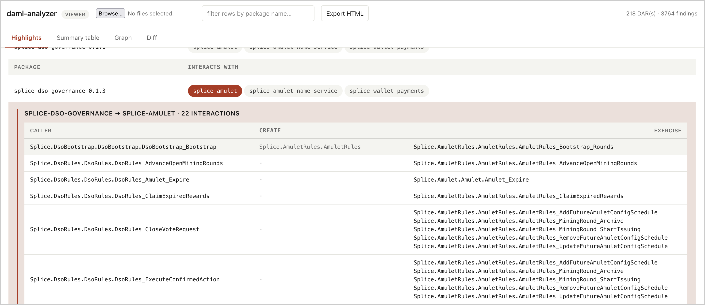
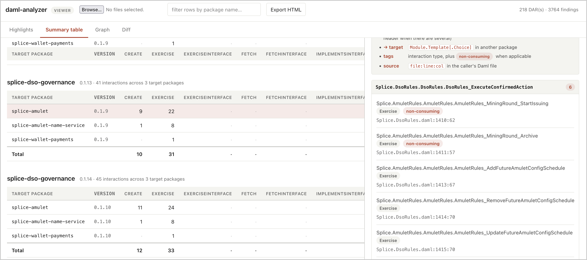
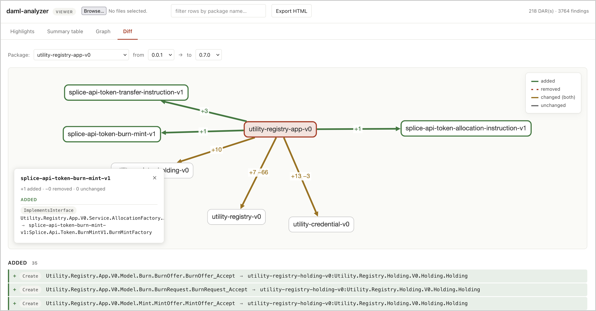

# daml-analyzer

[](https://github.com/Certora/daml-analyzer/actions/workflows/ci.yml)

A Static analysis tool for inspecting cross-package interactions in compiled Daml packages (`.dar` files).

<p align="center">
  
  <br>
  <em>Highlights tab showing an overview of all interactions and choices.</em>
</p>

## What it does

Given a compiled Daml package, daml-analyzer reports all **cross-package interaction** the code performs against contracts or interfaces defined in other packages — `Create`, `Exercise`, `Fetch`, `ExerciseInterface`, `ImplementsInterface`, and so on.
The tool tracks the caller choice that triggered it, the target package, module, template/interface and choice it reaches, whether the choice is consuming, and the source `file:line:col` (when available). The output is a JSON and a Graphviz DOT.

There is a browser-based [**viewer**](viewer/) that renders the JSON as Highlights, a Summary table, a Graph, and a Diff view that compares two versions of the same package. See [viewer/README.md](viewer/README.md) for details.

## Who this is for

Developers building protocols for Canton and auditors reviewing Canton deployments.

## Status

This project is under active development.

We have successfully run daml-analyzer on the [full Splice corpus](https://github.com/canton-network/splice/tree/main/daml/dars) (165 DARs) and all the files in the [utilities](https://docs.digitalasset.com/utilities/mainnet/reference/dar-versions/dar-versions.html) (53 DARs).

We would love to hear from users and get feedback from the community.

## Build

```bash
sbt compile           
sbt assembly # makes jar
```

## Run

See the various ways to run below. You can either run `sbt "run ..."` or `java -jar ...`.

| Command | Output |
|---|---|
| `sbt "run foo.dar"` | JSON to stdout |
| `sbt "run foo.dar -f dot"` | DOT to stdout |
| `sbt "run foo.dar -o out/"` | Writes both `out/foo.json` and `out/foo.dot` |
| `sbt "run foo.dar -f json -o out/"` | Only `out/foo.json` |
| `sbt "run foo.dar -f dot -o out/"` | Only `out/foo.dot` |
| `sbt "run dars-dir/ -o out/"` | For each `*.dar` in `dars-dir`, both `<name>.json` and `<name>.dot` in `out/` |
| `sbt "run dars-dir/"` | Error because batch mode requires `-o` |
| `sbt "run --help"` | Print usage |

If you make the JAR file, run like so:

```bash
java -jar target/scala-2.13/daml-analyzer-0.1.0-SNAPSHOT.jar foo.dar -o out/
```


## Visualize the results

Two options depending on the output format you produced.

**JSON → browser-based (recommended)** 

Open `viewer/index.html` in any browser, click the file input, and pick one or more `.json` files from your output directory. See [viewer/README.md](viewer/README.md) for details.

```bash
sbt "run foo.dar -o out/"
open viewer/index.html  # load out/foo.json using file picker
```

As a concrete example, run daml-analyzer on the Splice dar files [here](https://github.com/canton-network/splice/tree/main/daml/dars) (you can clone the repo) and upload all the resulting json files to the viewer. Here are the step by step instructions:

1. clone the splice repo
2. run `sbt assembly`
3. run `sbt "run path/to/splice/dars -o path/to/out/dir"`
4. open the `index.html` and upload the jsons from `path/to/out/dir`

<p align="center">
  
  <br>
  <em>Summary table: rows are target packages, columns are interaction-type counts. Click a row to see findings grouped by the choice that triggered them.</em>
</p>

<p align="center">
  
  <br>
  <em>Diff tab: comparing two versions of the same package. Edges are <strong>green</strong> for added interactions, <strong>red dashed</strong> for removed, <strong>amber</strong> for changed, and gray for unchanged.</em>
</p>


**DOT → PNG with Graphviz**

```bash
dot -Tpng path/to/foo.dot -o path/to/foo.png
```

## Test

```bash
sbt test
```

### AI Acknowledgement
Claude Code, Codex, Gemini, Copilot, and ChatGPT were used for assistance at various points. All suggestions were reviewed by the authors.
